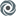

<body style="background-color: teal;">
    <h1>Adnan Niaz</h1>
    <h2> 🛠 Full-stack web developer + 🎨 UI/UX designer</h2>
    

        Technology adaptable and innovation-oriented software engineer with a passion for solving problems and learning
        new
        technologies. Experienced in HTML, CSS, Bootstrap, JavaScript, jQuery and specialized in the React/Redux
        front-end
        and Node back-end environment.
    

    <h3>Currently Learning:</h3>
    <ul>
        <li>REACT Advanced</li>
        <li>GraphGL</li>
        <li>Deno</li>
    </ul>
    <h4>My tinkering area:</h4>
    <ul>
        <li> <a href="https://repl.it/@adnanniaz">Repl.it: </a> Practice and code
            collaboration dojo</li>
        <li> <a href="https://www.sololearn.com/Profile/383429">SoloLearn: </a> Learn, Code
            and Challenge</li>
        <li> <a href="https://www.hackerrank.com/adnanniaz77">HackerRank: </a>
            Practice my Coding Skills and Solving code challenges</li>
    </ul>
    

        <a href="https://www.sanistudio.online"> 💻 Website</a>&nbsp;&nbsp;|
        <a href="https://drive.google.com/open?id=1Kd3K2eCeDBLFDuSfHqVtPW3C3ACL7ueC"> 📄 Resume</a>&nbsp;&nbsp;|
        <a href="mailto:adnanniaz77@yahoo.com"> ✉ Email</a>&nbsp;&nbsp;|
        <a href="https://www.linkedin.com/in/adnanniaz77/"> 🔗 LinkedIn</a>
    
&nbsp;
    

</body>dIn</a>

&nbsp;

